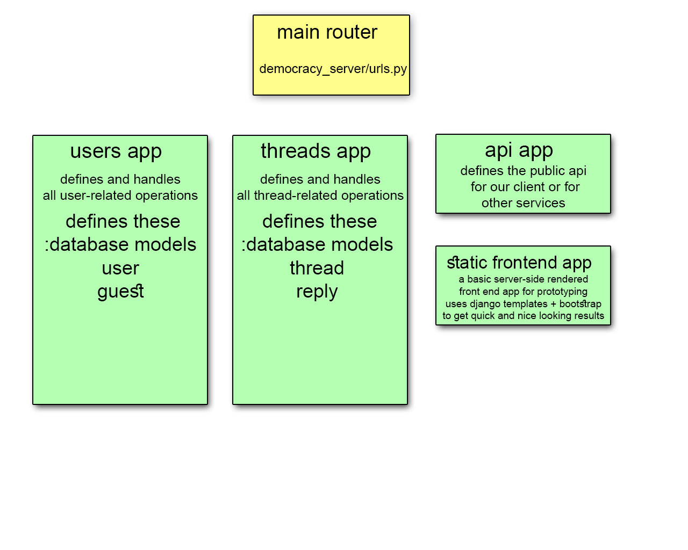

# latest updates
- react app can now load thread count using an api request on /api/thread_count

# how to run the server
---

1. git clone this repo.

2. inside it, make a new virtual environment (to isolate the project environment).   
`python -m venv .venv`

3. activate the virtual environment.   
`.venv\Scripts\activate.bat` on windows.   
`.venv/bin/activate` on linux.

3. install dependencies.   
`pip install -r requirements.txt`   

4. cd into the server directory.   
`cd democracy_server`

5. commit all database operations.   
`python manage.py migrate`

6. run the server.   
`python manage.py runserver`   

# how to run the client
---

1. cd into democracy_client   
`cd democracy_client`

2. install dependencies (create-react-app generated those)   
`npm install`

2. run the client.    
`npm start`

# basic architecture
---

